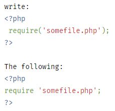
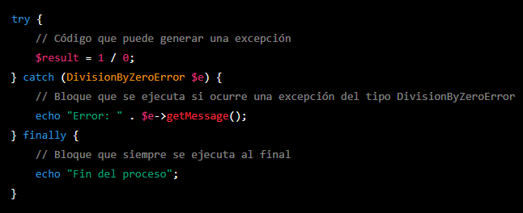

<?php

include_once("../php/plantilla_cabeza.php");

?>

<a href="../index.php">Atrás</a>
<h1>Conceptos basicos de PHP</h1>

<h4 style="color:blue">ESTRUCTURAS DE CONTROL EN PHP</h4>
<ol>
    <li><a href="#">¿Cuáles son las sintaxis alternativas de estructuras de control en PHP y muestre un 
    ejemplo?</a></li> 
    
PHP ofrece una sintaxis alternativa para algunas de sus estructuras de control, a saber: if, while, for, foreach, y switch. En cada caso, la forma básica de la sintaxis alternativa es cambiar la llave de apertura por dos puntos (:) y la llave de cierre por endif;, endwhile;, endfor;, endforeach;, o endswitch;, respectivamente.

    
Ejemplo:

    

    <li><a href="#">¿Cuál es la utilidad de las siguientes sentencias en PHP y las diferencias existentes entre 
    las mismas y muestre ejemplos:</a></li> 
    <ul><li>Require</li>
    
Require es idéntico a include, excepto que en caso de falla, también producirá un error fatal de nivel E_COMPILE_ERROR. En otras palabras, detendrá el script mientras que include solo emite una advertencia (E_WARNING) que permite que el script continúe.

    
    </ul>
    <ul><li>Include</li>
    
Los archivos se incluyen en función de la ruta del archivo proporcionada o, si no se proporciona ninguna, la ruta de inclusión especificada. Si el archivo no se encuentra en include_path, include finalmente buscará en el propio directorio del script de llamada y en el directorio de trabajo actual antes de fallar. La construcción de inclusión emitirá un E_WARNING si no puede encontrar un archivo; este es un comportamiento diferente al de require, que emitirá un E_ERROR.

    
    </ul>
    <ul><li>Require once</li>
    
La sentencia require_once es idéntica a require excepto que PHP verificará si el archivo ya ha sido incluido y si es así, no se incluye (require) de nuevo.

    
    </ul>
    <ul><li>Include once</li>
    
La sentencia include_once incluye y evalúa el fichero especificado durante la ejecución del script. Tiene un comportamiento similar al de la sentencia include, siendo la única diferencia de que si el código del fichero ya ha sido incluido, no se volverá a incluir, e include_once devolverá true. Como su nombre indica, el fichero será incluido solamente una vez.

    
include_once se puede utilizar en casos donde el mismo fichero podría ser incluido y evaluado más de una vez durante una ejecución particular de un script, así que en este caso, puede ser de ayuda para evitar problemas como la redefinición de funciones, reasignación de valores de variables, etc..

    
    </ul>
     
    <li><a href="#">¿Cuáles son los errores (Exception) más comunes en PHP y como se pueden controlar?</a></li> 
        <ol>
            <li><b>'ParseError'</b>: Este error ocurre cuando PHP no puede analizar correctamente el código. Puede ocurrir cuando hay errores de sintaxis, falta de punto y coma, o problemas con el uso de comillas. Este error no puede ser controlado.</li>
             
            <li><b>'TypeError'</b>: Este error ocurre cuando se utiliza una variable o argumento en una función de un tipo diferente al esperado. Por ejemplo, intentar sumar una cadena con un número. Para controlarlo, se pueden utilizar las funciones is_numeric() o is_string() para verificar el tipo de variable antes de realizar una operación.</li>
             
            <li><b>'UndefinedVariable'</b>: Este error ocurre cuando se intenta utilizar una variable que no ha sido definida previamente. Para evitarlo, es importante declarar todas las variables antes de utilizarlas.</li>
             
            <li><b>'DivisionByZeroError'</b>: Este error ocurre cuando se intenta dividir un número por cero. Para evitarlo, se debe verificar que el divisor no sea cero antes de realizar la operación.</li>
             
            
Ejemplo:

            
        </ol>
         
    <li><a href="#">¿Qué son funciones de URL?</a></li> 
    
Las funciones de URL en PHP y HTML son aquellas que permiten trabajar con URLs (Uniform Resource Locators) o direcciones web de forma más fácil y eficiente.

    <ul><li>base64_decode()</li>
    
<b>urldecode()</b>: Esta función decodifica una cadena de texto que ha sido codificada con la función urlencode().

    </ul>
    <ul><li>base64_encode()</li>
    
<b>base64_encode()</b>: Es una función en PHP que codifica una cadena de texto en base64 y devuelve su valor codificado. La codificación en base64 es un proceso que convierte datos binarios en una cadena de texto ASCII que es más fácil de transmitir por medios que no son binarios, como por ejemplo a través de correo electrónico o en una URL.

    
Toma una cadena de texto como argumento y devuelve una cadena de texto codificada en base64 que representa los datos originales.

    </ul>
    <ul><li>urldecode()</li>
    
<b>urldecode()</b>: Esta función decodifica una cadena de texto que ha sido codificada con la función urlencode().

    </ul>
    <ul><li>urlencode()</li>
    
<b>urlencode()</b>: Esta función codifica una cadena de texto para que pueda ser utilizada en una URL de forma segura. Por ejemplo, convierte espacios en blanco en "%20".

    </ul>
     
</ol>

<?php 
include_once("../php/plantilla_pie.php")
?>